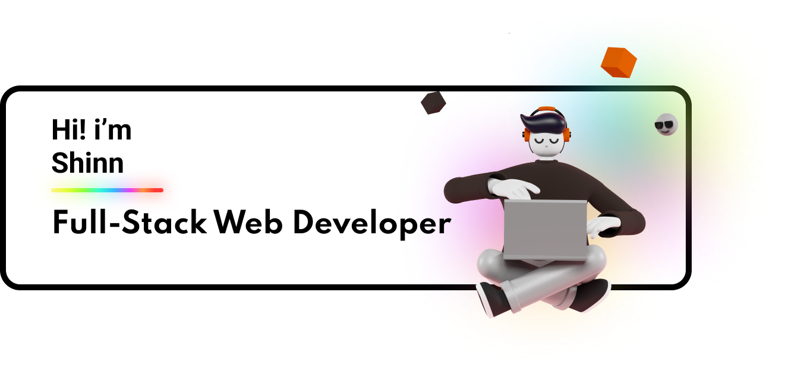

  

<h1 align="center">Hi, I'm Shinn 👋</h1>

  <b>Full-Stack Web Developer & Network Specialist</b>

  

---

### 🛠️ Tech Stack & Tools

  
  
  
  
  
  

---

### 💻 Services & Expertise
- **Paket NetKopi:** Network & Router Management Solution via MikroTik.
- **Web Coffee App:** Full-stack web application built with PHP, MySQL & Tailwind CSS.
- **System & Deployment:** Linux (Ubuntu), OpenCV, Vercel.
